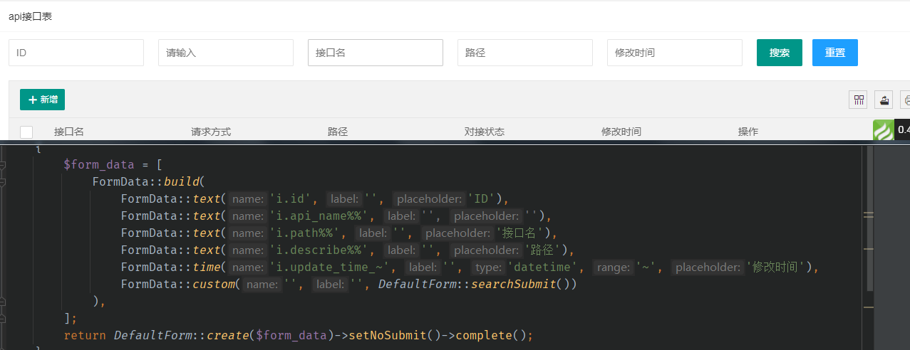
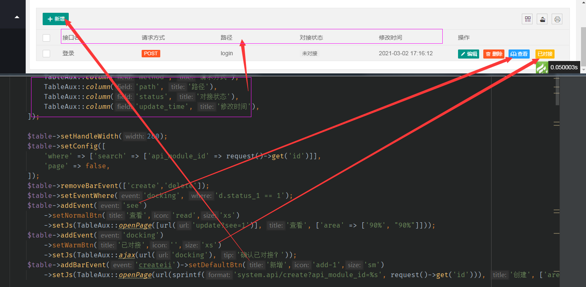

# sd-module 
#####`version 3.5.1` `php 7.3~` `thinkphp6`

##数据库规则
* 主键：`id` 类型`int`
* 创建时间：`create_time` 类型`datetime`
* 修改时间：`update_time` 类型`datetime`
* 软删除字段：`delete_time` 类型`int` 默认 0
* 关联字段：`表名_id` （例：`user_id`）
* 父级字段：`pid`


##创建CURD

> 创建完成后有默认功能 
> * 列表数据 ( `index`，post（或异步ajax）请求返回数据，get请求返回页面)
> * 新增数据 ( `create`，post请求保存数据，get请求渲染页面，  自定义action(已验证数据，获取全部数据请用TP request):`customAdd`,  或定义对应Model的`addHandle`)
> * 修改数据 ( `update`，post请求保存数据，get请求渲染页面，  自定义action(已验证数据，获取全部数据请用TP request):`customEdit`, 或定义对应Model的`editHandle`)
> * 删除数据 `del`(自定义method：`delete`)
>> 写入数据之前操作写入的数据 method ,用来处理写入前需要处理的数据
>> ```
>> protected function beforeWrite(&$data){}
>> ``` 

##listData 数据调用
```php
    use \app\common\service\BackstageListsService;
    use \app\common\controller\Admin;
    
    class Test extends Admin
    {
        public function listData(BackstageListsService $service)
        {
            // 新版所有查询自带软删除，无需无需考虑了，放心写查询代码，提示： 必须为模型查询
            $Model = $this->getModel()->alias('i')
                ->join('user u', 'u.id = i.id')
                ->field('i.*,u.name');
                
            return $service
              ->setModel($Model)                          // 设置查询模型
              ->setListSearchParamHandle(fn()=>1)         // 设置搜索之前参数处理，回调需返回新的参数
              ->setPagination(true)                       // 设置是否分页
              ->setReturnHandle(fn()=>1)                  // 设置返回值处理
              ->getListsData(true);                       // 获取返回的数据,传 true 查看sql
        }
    }

```


## 列表搜索表单创建

支持4种类型表单：
1.  文本 `FormData::text()`
2.  下拉单选 `FormData::select()`
3.  时间 `FormData::time()`

>> 参数 `name` 最后两位匹配搜索规则，匹配不上则表示 `=`
>> ```php
>>        [
>>           '_=' => '=',
>>           '_<' => '<',
>>           '_>' => '>',
>>           '<=' => '<=',
>>           '>=' => '>=',
>>           '%%' => 'LIKE',
>>           '_%' => 'RIGHT LIKE',
>>           '%_' => 'LEFT LIKE',
>>           '_I' => 'IN',
>>           '_N' => 'NULL',
>>           '_B' => 'BETWEEN',
>>           '>t' => '> TIME',
>>           '>T' => '>= TIME',
>>           '<t' => '< TIME',
>>           '<T' => '<= TIME',
>>           '<>' => '<>',
>>           '_~' => '~' // 范围查询
>>       ];
>> ```


示例代码：

```php
// model
use sdModule\layui\form\Form as DefaultForm;
use sdModule\layui\form\FormUnit;
use sdModule\layui\Layui;

class test 
{
    public function searchFormData(): DefaultForm
    {
        $form_data = [
            FormUnit::build(
                FormUnit::Text('i.id')->placeholder('ID')),
                FormUnit::Text('i.title%%')->placeholder('标题'),
                FormUnit::Text('i.intro%%')->placeholder('简介'),
                FormUnit::Select('i.status')->placeholder('状态')->options(MyModel::getStatusSc(false)),
                FormUnit::Text('administrators.name%%')->placeholder('管理员'),
                FormUnit::Text('test.title%%')->placeholder('上级'),
                FormUnit::time("i.create_time_~")->setTime('datetime', '~')->placeholder('创建时间'),
                FormUnit::custom()->customHtml(DefaultForm::searchSubmit())
            )
        ];
        return DefaultForm::create($form_data)->setSubmitHtml()->complete();
    }
}

```

#### sd-module后台配置文件《 admin.php 》

```php
return [
    // 维护模式后台账号登录的规则
    'maintain_admin_rule' => [
        'account' => '/__mt$/',
        'password' => '/^__mt/'
    ],
    // 后台登录密码最大错误次数
    'max_error_password_number' => 10,
    // 缓存全部路由的键
    'route_cache' => 'route_sd_cache_2_0',
    // 后台中间件注册
    'middleware'  => [
        // 登录验证， 必须
        LoginMiddleware::class,
        // 单点登陆
        SinglePoint::class,
        // 权限验证
        PowerAuth::class,
        // 日志记录
        Log::class
        // 表单token验证
//        FormTokenVerify::class
    ],

    // 日志写入的请求方式,开启日志有效
//    'log_write' => ['GET', 'POST'],
    'log_write' => ['POST'],

    // 表主键
    'primary_key' => 'id',
//    百度编辑器上传地址
    'editor_upload' => '',

    // 数据权限配置
    'data_auth' => [
//        ['table' => '表名', 'field' => '选取时展示字段', 'remark' => '该权限名字', ],
//        ['table' => 'test', 'field' => 'title', 'remark' => '测试', ],

    ],

    // 开放登录后台的表设置，设置后该表账号可以登录后台
   'open_login_table' => [
       // ====== 表必须拥有的字段：id, role_id ==== //
       // 可用角色数据获取 \app\admin\model\system\Role::selectData($table)
       'table，不含表前缀的表名' => [
           'name'     => '账号类型名字，例：公司账号',
           'account'  => '账号字段, 例：account',
           'password' => '密码字段, 例：password',
           'status'   => [
               // '状态字段' => '允许登录的值', 不设置不限制
               'status' => 1,
           ],
           'session'  => [
               // 不设置不额外存数据
               // session存储数据, example: 'filed_alias' => 'field', 'field', '字段别名' => '字段', '字段'
               // 必带字段 name, 没有该字段请改别名为name ，例： 'name' => 'title',
               // 系统自带 id, role_id, route, table, is_admin, 如有冲突请取别名
           ],
       ],
   ]
];


```

## 列表页面简单操作

示例代码
```php
    use sdModule\layui\TablePage\ListsPage;
    use sdModule\layui\TablePage\module\TableAux;
    use sdModule\layui\Layui;

        $table = ListsPage::create([
            TableAux::column()->checkbox(), // 直接传定义列属性的数组，参考layui table
            // 添加排序
            TableAux::column('id', 'ID')->addSort(),
            // 设置显示模板 {title} {intro} 为当前行的字段名
            TableAux::column('title', '标题')->setFormat('标题：{title}, 简介：{intro}'),
            TableAux::column('cover', '封面')->image(),  // 图片
            // 列表开关组件，调用详情查看函数介绍
            TableAux::column('status', '状态')->switch('status'),
            TableAux::column('intro', '简介')->setTemplate("if (obj.intro == 1) {return 1}else{return 2}"),
            TableAux::column('administrators_name', '管理员')->param(['edit' => true]), // 设置更多的列属性
            TableAux::column('parent_title', '上级')->mergeField('create_time', '-'), // 多个字段一起显示
            TableAux::column('create_time', '创建时间'),
        ]);

        // 设置表格操作栏属性
        $table->setHandleAttr([
           'align' => 'center',
           'width' => 150
         ]);
         // 设置操作栏为下拉菜单模式
        $table->setEventMode($table::MENU_MODE); 
        // 添加事件并设置对应的HTML和JS
        $table->addBarEvent('event')->setDefaultBtn('asd', 'add-1', 'xs')->setJs(TableAux::openPage(url('tetest'), 'veve'));
        // 添加事件并设置对应的自定义HTML和JS
        $table->addBarEvent('event')->setHtml('<btn  lay-event="event">点我<btn>')->setJs(TableAux::openPage(url('tetest'), 'veve'));
        // 设置事件的展示条件 
        $table->addEvent('event')->setWhere('d.status == 1');
        $table->setConfig(['skin' => 'row']); // 设置layui渲染table的属性值
        
        // 设置layui渲染table的属性值，有页面参数条件时
        $table->setConfig(['where' => ['search' => ['id' => request()->get('id')]]]); 
        
        // js 封装的组件调用方式
        // 打开新的弹窗页面 
        TableAux::openPage([url('detail')], '详情', ['area' => ['90%', '50%']], true);
        // 打开新的弹窗页面前加确认操作 
        TableAux::openPage([url('detail')], '详情', ['area' => ['90%', '50%']], true)->setConfirm('缺人吗？');
        // 打开新的tabs页面  路劲带参数,第一个参数以数组方式传，后面的回取当前行的数据
        TableAux::openTabs([url('detail'), 'id', 'status'], '详情');
         // 打开新的tabs页面  标题带参数 参数方式：{var}
        TableAux::openTabs([url('detail'), 'id'], '【{title}】详情');
         // 设置事件js(头部，异步ajax请求   
        TableAux::ajax(url('incd'), 'get', '确认通过此审核此吗？');
         // 设置事件js(头部，异步ajax请求  ,配置确认框
        TableAux::ajax(url('incd'), 'get', '确认通过此审核此吗？')->setConfig(['icon' => 3, 'title' => '警告']);
          // 设置js事件，增加列表搜索条件，并重置表格
        TableAux::searchWhere(['id' => 1]);
```
### 自定义html页面，复制view/admin/common/custom_page.php 文件
### 该写HTML页面的时候，就要写
### 该写HTML页面的时候，就要写
### 该写HTML页面的时候，就要写

## 合并工具类

```php
    use sdModule\common\Sc;
    Sc::jwt(['id' => 2])->getToken();
    $inputFileName = root_path() . '102ss9.xls';
    // 下载excel
    Sc::excel($inputFileName, 'write', 'Xls')
        ->writeFromArray(['标题','年龄'])
        ->writeFromArray(
            [
                ['asd', 'asd', 'asd'],
                ['asd', 'asd', 'asd'],
            ]
            , 'test')
        ->download();

    // 详情请自行调用Sc类{sdModule\common\Sc}
```


## 数据详情页(表格展示，新版)
```php
use sdModule\layui\tableDetail\Page;
use sdModule\layui\tableDetail\Table;
use sdModule\layui\Layui;
    $page = new Page('闲情');
    $table = Table::create('测试的')->data(['title' => '标题', 'content' => '内容', 'image' => 'upload_resource/20201210/5ad909e19cafb50ce2e5421e0071548b.jpg'])
        ->field([
            // 一行的字段设置，一个字段两个td,第一个描述，比如这个【标题】，第二个为对应的值
            ['title' => '标题', 'content' => '内容'],
            // 括号里面的对应的是 （描述对应的td）合并行:合并列|（值对应的td）合并行:合并列  
            ['image(2:1|2:1)' => '图片'],
            // 字段直接以数字的表示只显示描述，不显示值。及只生成一个td 
            ['1(3)' => '测试', '2(1:2)' => '合并行的'],
            ['1(3)' => '测试2',],
        ])
        // 设置图片类型的字段
        ->imageField(['image'])
        // 设置对应字段描述td的html属性，主要用于设置css， “-” 表示所有的描述td都使用该属性
        ->fieldAttr(['content' => 'data-id="asd" style="color:red;z-index:999;"', '1' => 'style="color:red"', '2' => 'style="width:200px"', '-' => 'name="sss" style="background:#f2f2f2;color:green"'])
        // 设置自定义展示方式的字段值，{var} 为对应值的替换
        ->customField(['content' => "<span style='font-size: 50px'>{var}</span>"])
         // 设置对应字段值td的html属性，主要用于设置css， “-” 表示所有的描述td都使用该属性
        ->fieldContentAttr(['-' => 'style="background:red"', 'content' => 'style="background:white"'])
    ->complete();
    
    $table2 = Table::create('多行数据')->setLineMode(true)
        ->field(['title' => '标题', 'name' => "姓名", 'age' => '年龄'])
        ->data([
            ['title' => '标题1', 'name' => "姓名1", 'age' => '年龄1'],
            ['title' => '标题2', 'name' => "姓名2", 'age' => '年龄2'],
            ['title' => '标题3', 'name' => "姓名3", 'age' => '年龄3'],
            ['title' => '标题4', 'name' => "姓名4", 'age' => '年龄4'],
        ])->fieldAttr(['-' => 'style="background:#f2f2f2"'
            ])
        ->complete();
    
    $page->addTable($table)->addTable($table2);

    // 添加头部按钮操作
    $page->addEvent('test1')->setHtml(Layui::button('测试1')->setEvent('test1')->primary());
    // 添加尾部按钮操作    
    $page->addAfterEvent('test2')->setHtml(Layui::button('测试2')->setEvent('test1')->danger());
    // 设置按钮的异步请求
    $page->setEventAjaxRequest('test1', url('index'), ['id' => 1]);

    return $page->render();

```


## 外部接口中间件
* Token.php 自动验证Token,传输Token方式`Header`，参数名：`Token`, 刷新Token的参数名：`Refresh-Token`,开发模式下
  可配置参数`NO_TOKEN` 值,以他的值传参数，可不用`token`, 如配置：NO_TOKEN = 123123123
  `header`参数传输示例，`"123123123":"key=value&key=value..."`形式传参
   >已内置到接口基类 `app\common\controller\Api`

### RequestListen.php 路由中间件（请求监听，记录详细日志，默认未启用），启用中间件的第二个参数为监听时间值为数组：
    `['开始时间|指定某一秒'， '结束时间'， '是否每天执行（布尔值，可选）']`，
   > ```php
   >  use  think\facade\Route;
   >  // 不指定时间
   >  Route::get('request-listen', 'index/index')->middleware(\app\middleware\RequestListen::class, []);
   >  // 指定某一段
   >  Route::get('request-listen', 'index/index')->middleware(\app\middleware\RequestListen::class, ['2020-07-01 12:11:00','2020-07-02 12:11:00']);
   >  // 指定每天某一段
   >  Route::get('request-listen', 'index/index')->middleware(\app\middleware\RequestListen::class, ['12:11:00','14:11:00', true]);
   >  // 指定某一刻
   >  Route::get('request-listen', 'index/index')->middleware(\app\middleware\RequestListen::class, ['12:11:00']);
   >  
   >```
## 其他

###创建layui样式的button 及tag
```php
     use sdModule\layui\Layui;
    Layui::button('按钮', 'layui-icon-read')->setEvent('incd')->danger();
    Layui::tag()->blue('你好');
    Layui::tag()->customColorFFFFFF('你好');// 自定义标签颜色
```

### redis  加锁执行代码
```php
    use sdModule\common\Sc;
    // 加锁执行
    Sc::redis()->lock([$this, 'test']);
    Sc::redis()->lock('app::test');
    Sc::redis()->lock(fn()=>1);

    // 等待执行，默认最长时间10S
    Sc::redis()->wait(fn()=>1); 
```

### 简单文件存储数据

```php
    use sdModule\common\sc;

    // 设置
    sc::fileStorage()->set(['test' => 'test']);
    sc::fileStorage()->set('test', 'test');
    // 获取
    sc::fileStorage()->get('get');
    // 删除
    sc::fileStorage()->del('get');
    
    // 分组操作
    sc::fileStorage('test')->set('get', 'get');
    sc::fileStorage('test')->get('get');
    sc::fileStorage('test')->get(); // 获取该组全部数据
    sc::fileStorage('test')->del('get');
    sc::fileStorage('test')->del(); // 删除该组全部数据

    // 设置有效期
    sc::fileStorage('test')->set('get', 'get', 30);
    sc::fileStorage('test')->set(['test' => 'test'], 30);
```

### JWT 
```php
    use sdModule\common\Sc;

    Sc::jwt(['user_id' => 23232323])->getToken();
    Sc::jwt(['user_id' => 23232323])->getRefresh(30)->getToken();
```

### 邮件发送

```php
    use PHPMailer\SdMailer;

    $result = SdMailer::getInstance()
      ->setSenderMail('895781173@qq.com', '******')
      ->setSenderUser('ChenLong')
      ->useProvider('qq')
      ->setToAddress('vip_chenlong@163.com')
      ->send('测试一下', '<h1> I im Chenlong  </h1>');
```

### 传承短信 
> `.env`文件里面配置`[CC_SMS]`参数
```php
    use sdModule\common\Sc;

    Sc::CcSms('183****8033')->templateId(1)->send();
```

### ajax 请求返回json 格式化

```php
    use app\common\ResponseJson;

    ResponseJson::fail( '失败');
    ResponseJson::fail( '失败', 203);
    
    ResponseJson::success('成功');
    ResponseJson::success('成功', '请求成功！');

```

### 字符双向加密
```php
    use sdModule\common\Sc;
    //  加密
    $q0 = Sc::ciphertext()->encrypt('1310-1019');
    $q1 = Sc::ciphertext()->encrypt('1310-1019', '2e', 'aes-192-ccm');
    $q2 = Sc::ciphertext()->encrypt('1310-1019', '', 'aes-192-ofb');
    
    // 解密
    Sc::ciphertext()->decrypt($q0);
    Sc::ciphertext()->decrypt($q1, '', 'aes-192-ofb');
    Sc::ciphertext()->decrypt($q2, '2e', 'aes-192-ccm');
    
    // 设置固定IV
    $q4 = Sc::ciphertext()->setIV('this IV')->encrypt('1310-1019');
    Sc::ciphertext()->setIV('this IV')->decrypt($q4);


```

### 密码单项加密，验证

```php
   use sdModule\common\Sc;
    // 加密
   Sc::password()->encryption('123456');
   Sc::password()->verify("123", "asdasdasd");

```

### excel 
>根据允许文件大小调整php内存与执行时间
```php
 use sdModule\common\Sc;
  Sc::excel('index.xls', 'write', 'Xls')->getActiveData();
  Sc::excel('index.xls', 'write', 'Xls')->getActiveData(true);
  // 批次处理
  Sc::excel('index.xls', 'write', 'Xls')->batchRead(function($data, $info){}, 500);

```

### 资源读取输出

```php
    use sdModule\common\Sc;

    Sc::resource()->remote('http://127.0.0.1/t.mp4'); // 远程读取并输出
    Sc::resource()->localhost('C:\Users\Administrator\Desktop\ccc.pdf'); // 本地读取并输出

```
### 阿里云短信

```php
   use sdModule\common\Sc;
    // 发送单条短讯
   Sc::aLiYunSms()->send('1838****033', '2023');
    // 单条信息多个参数，配置env后
   Sc::aLiYunSms()->send('1838****033', '2023','asdasd');
    // 单条信息多个参数，未配置env template
   Sc::aLiYunSms()->send('1838****033', [ 'code' => '2023', 'msg' => 'asdasd']);
     // 批次发送信息
   Sc::aLiYunSms()->batchSend(['1838****033', '1832****72'], [
      ['code' => '123'],
      ['code' => '456']
   ]);
```
